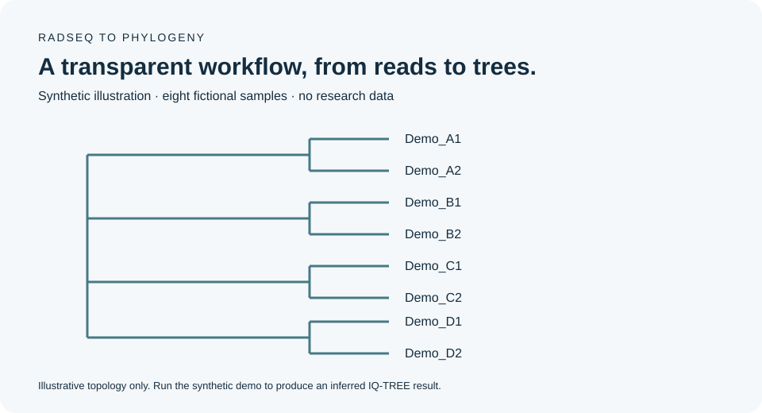

# RADseq to Phylogeny

**A documented single-end RADseq workflow for sequence quality control, de novo assembly, and maximum-likelihood phylogenetics.**

[Quick start](#quick-start) · [Research workflow](#research-workflow) · [Parameters](params/README.md) · [Synthetic example](examples/README.md) · [Historical record](docs/legacy/README.md)



Developed around Pauline Owusu-Ansah's work on species boundaries and gene flow in *Ambystoma barbouri* and *A. texanum* at Miami University. The repository provides portable analysis entry points and preserves the original research notes separately.

## What is included

| Stage | Tool | Maintained entry point |
| --- | --- | --- |
| Read quality reports | FastQC | `scripts/workflow.py qc` |
| Single-end adapter and quality filtering | fastp | `scripts/workflow.py trim` |
| De novo RADseq assembly | ipyrad | `scripts/workflow.py assemble` |
| Alignment checks | Python standard library | `scripts/workflow.py check` |
| Model selection and phylogenetic inference | IQ-TREE 3 | `scripts/workflow.py infer` |

**Scope:** the maintained read workflow starts with demultiplexed single-end FASTQ files. Clone filtering and demultiplexing require library-specific decisions; see [preprocessing guidance](docs/preprocessing.md). This is a sequence of explicit stages, not an unattended raw-pool-to-tree pipeline.

## Quick start

### 1. Get the repository and environment

Linux or WSL with Conda/Mamba is the intended platform.

```bash
git clone https://github.com/codewithPauline/ipyrad_to_IQTREE.git
cd ipyrad_to_IQTREE
conda env create -f env/environment.yml
conda activate ipyrad-iqtree
python scripts/workflow.py --help
```

The environment specifies ipyrad 0.9 and IQ-TREE 3; it is a dependency specification, not an exact lockfile. A complete environment solve has not yet been verified for this revision. Record the resolved environment when you run an analysis:

```bash
mkdir -p results
conda list --explicit > results/conda-explicit.txt
ipyrad --version
iqtree3 --version
```

If your installation names the IQ-TREE 3 binary `iqtree`, pass `--binary iqtree` to the inference command after checking its version.

### 2. Try the synthetic alignment

The included eight-sample alignment is entirely fictional and needs no research data.

```bash
python scripts/workflow.py check examples/demo.phy
python scripts/workflow.py infer examples/demo.phy \
  --out results/demo/demo --threads 1 --seed 2026
```

The inference command runs ModelFinder (`MFP`), 1,000 ultrafast bootstrap replicates, and 1,000 SH-aLRT replicates. Use `--model TEST` if deliberately matching that historical model-selection setting. A fixed seed helps reproducibility within a consistent software environment; record the tool versions and thread count too.

To inspect the exact command without running IQ-TREE or creating output directories:

```bash
python scripts/workflow.py infer examples/demo.phy \
  --out results/demo/demo --threads 1 --dry-run
```

**The displayed tree is an illustration of the synthetic design, not an inferred result.** The demo exercises alignment checks and inference; it does not reproduce the Ambystoma study or test assembly from FASTQ.

## Research workflow

Run commands from the repository root. Replace the example filenames and adapter with values from your own library protocol.

### 1. Review demultiplexed reads

```bash
python scripts/workflow.py qc data/sorted/SAMPLE_A.fastq.gz \
  --out qc/before --threads 4
```

### 2. Trim one sample at a time

```bash
python scripts/workflow.py trim data/sorted/SAMPLE_A.fastq.gz \
  --out results/trimmed/SAMPLE_A --threads 4 \
  --adapter YOUR_CONFIRMED_ADAPTER_SEQUENCE --min-length 35
```

The adapter placeholder is intentionally rejected until replaced with an A/C/G/T sequence. Inspect `fastp.html` and `fastp.json`. Each sample gets its own output directory. Stage the resulting reads under unique sample filenames as described in [preprocessing](docs/preprocessing.md), then repeat FastQC in a new directory. Existing nonempty QC/trim output directories are rejected to prevent accidental overwrites.

### 3. Configure and run ipyrad

```bash
ipyrad -n project
# Edit params-project.txt using params/README.md before proceeding.
python scripts/workflow.py assemble params-project.txt \
  --steps 1234567 --threads 4
```

The wrapper does not install software, activate environments, force completed steps, or choose biological filtering thresholds. It passes your reviewed parameter file to ipyrad. Use only the CPUs allocated to your job; the default is one.

The historical parameter file and README disagree on clustering and adapter filtering. Final assembly settings, sample retention, and reported locus totals need confirmation against the original logs. See [the provenance notes](docs/legacy/README.md).

### 4. Validate the alignment and infer the tree

```bash
python scripts/workflow.py check results/project_outfiles/project.phy
python scripts/workflow.py infer results/project_outfiles/project.phy \
  --out results/phylogeny/project --threads 4 --seed 2026
```

Replace the example alignment path with the actual ipyrad PHYLIP output. The validator accepts **relaxed sequential DNA PHYLIP**, with one complete sequence per line. It checks sample/site counts, unique IDs, nucleotide symbols, and samples lacking any resolved bases. It does not support interleaved PHYLIP or silently remove individuals.

Use the full locus alignment for this example. SNP-only alignments need explicit consideration of ascertainment bias and an appropriate model; do not apply the defaults indiscriminately. Re-running the same inference command lets IQ-TREE manage checkpoint resumption. No forced `--redo` option is added.

## Outputs and interpretation

| Output | Purpose |
| --- | --- |
| `*.treefile` | Inferred maximum-likelihood tree |
| `*.iqtree` | Model, fit, and branch-support report |
| `*.log` | Run progress and analysis details |
| `*.ufboot` | Bootstrap trees |
| `*.ckp.gz` | IQ-TREE checkpoint for resuming a run |

Check sample names against metadata and inspect branch support before biological interpretation. A phylogenetic tree alone does not establish species boundaries or demonstrate gene flow. Rooting requires a justified outgroup or other explicit choice.

## Repository guide

- `scripts/workflow.py`: maintained CLI with input checks and dry-run support.
- `env/environment.yml`: Conda dependency specification.
- `params/README.md`: parameter decisions to review before assembly.
- `examples/`: synthetic alignment, generator, and illustrative Newick tree.
- `figures/`: clearly labeled synthetic illustration.
- `tests/`: input-validation and command-execution tests.
- `docs/legacy/`: original files preserved for provenance, not active instructions.

The existing `iqtree.sh` and selected numbered shell scripts now forward arguments to the maintained CLI. Run them with `bash`; no executable bit is required.

## Validation status

```bash
python -m unittest discover -s tests -v
```

Automated tests cover malformed alignments, duplicate IDs, paths containing spaces, dry runs, command failure propagation, argument forwarding, and output protection. CI repeats these checks with standard Python. **Mock executables test orchestration; they do not establish scientific correctness.** A full Conda solve, actual IQ-TREE demo, and end-to-end ipyrad run still require validation in an analysis environment.

## Data and reproducibility

No private sequencing data or sample coordinates have been added. Generated results and common raw-data formats are ignored by Git. Keep original reads, final parameter files, sample manifests, software versions, and run logs with the research record. Historical claims remain archived rather than being presented as newly verified results.

## Software references

Use the original software citations when publishing analyses:

- [ipyrad](https://github.com/dereneaton/ipyrad)
- [IQ-TREE command reference](https://iqtree.github.io/doc/Command-Reference)
- [fastp](https://github.com/OpenGene/fastp)
- [FastQC](https://www.bioinformatics.babraham.ac.uk/projects/fastqc/)
- [Stacks](https://catchenlab.life.illinois.edu/stacks/)

## Author

**Pauline Owusu-Ansah** · Ph.D. Candidate in Biology · Miami University  
Computational biology, population genomics, and evolutionary biology  
[GitHub](https://github.com/codewithPauline) · [LinkedIn](https://www.linkedin.com/in/pauline-owusu-ansah-010250192/)
